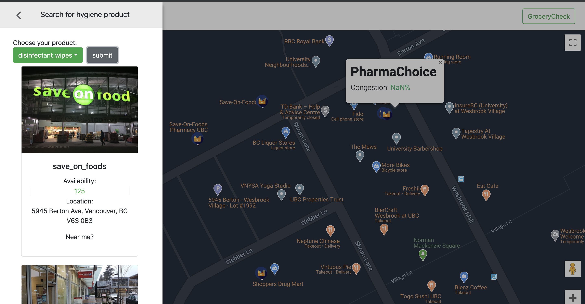

The project is a web app solution aiming to help the community get through the COVID-19 pandemic, with two core functionalities: real-time store congestion status tracking and inventory tracking.

## Highlights
The project has won the RBC 2020 Summer Innovation Challenge Best Hand-off Package award, out of 30 teams.

## The Team
The Early Birds #invt_challenge_team29
- Developers: Nancy(Leqi) Wan, Luke Zhang, Alexander (Alex) Efimov, Garima Aggarwal
- Communication Analyst/Project Coordinator: Rachel Nakka, Hayley (Hae Eun) Lee

## Technologies
#### FE:
- ReactJS, React BootStrap for inventory query page
- HTML/CSS, JavaScript and Google Maps API for congestion page(map)
#### BE:
- NodeJS used to write APIs to retrieve inventory data
- Google Maps APIs for store data

## Run the project
To initialize the front-end server, please run:

### `npm start`

Runs the app in the development mode. 
Open [http://localhost:3000](http://localhost:3000) to view it in the browser.

The page will reload if you make edits. 
You will also see any lint errors in the console.

To initialize the back-end server, please run the following line under `/api` folder:

### `npm start`

**Note: Please remember to add a `.env` under root to set your environment variables(i.e. here you need to set GCP_API_KEY in order to use the GCP service)

More details will be added in the future.
